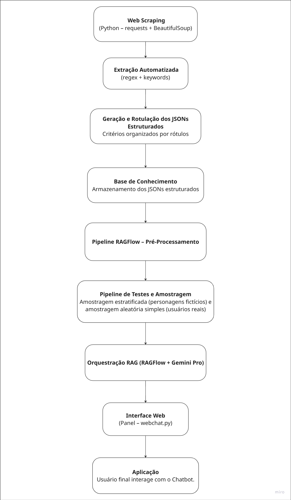

## Histórico de versões

| Versão | Alteração       | Responsável         | Data Alteração |
|--------|-----------------|---------------------|----------------|
| 1.0    | Adicionando arquitetura | Mariana Pereira |  10/12/2025 |

# Fluxo de Arquitetura do Sistema RAG

O sistema desenvolvido implementa uma solução completa de **RAG** voltada para o apoio no contexto dos programas sociais. A arquitetura integra processos de **coleta de dados**, **estruturação automática**, **indexação semântica**, **recuperação inteligente** e **interação em tempo real** com o usuário.

O objetivo principal é permitir que o chatbot entregue respostas **fundamentadas**, **precisas** e **alinhadas aos documentos oficiais** sobre benefícios sociais. Para isso, o fluxo combina técnicas clássicas de raspagem e limpeza de dados com ferramentas modernas como o **RAGFlow** (para chunking, embeddings e recuperação semântica) e o **Gemini Pro** (para geração das respostas).

O pipeline foi projetado para ser **modular**, **transparente** e **auditável**, permitindo rastrear cada resposta até os trechos originais dos documentos. Além disso, incorporamos um processo de **testes e amostragem**, que garante validação contínua e confiável do sistema.

A seguir, apresentamos o fluxograma completo que descreve todo o processo, do scraping inicial à interação final com o usuário, conforme implementado no projeto.

