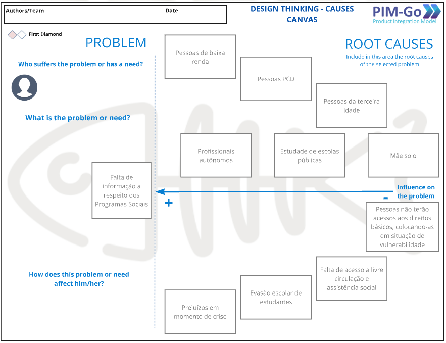
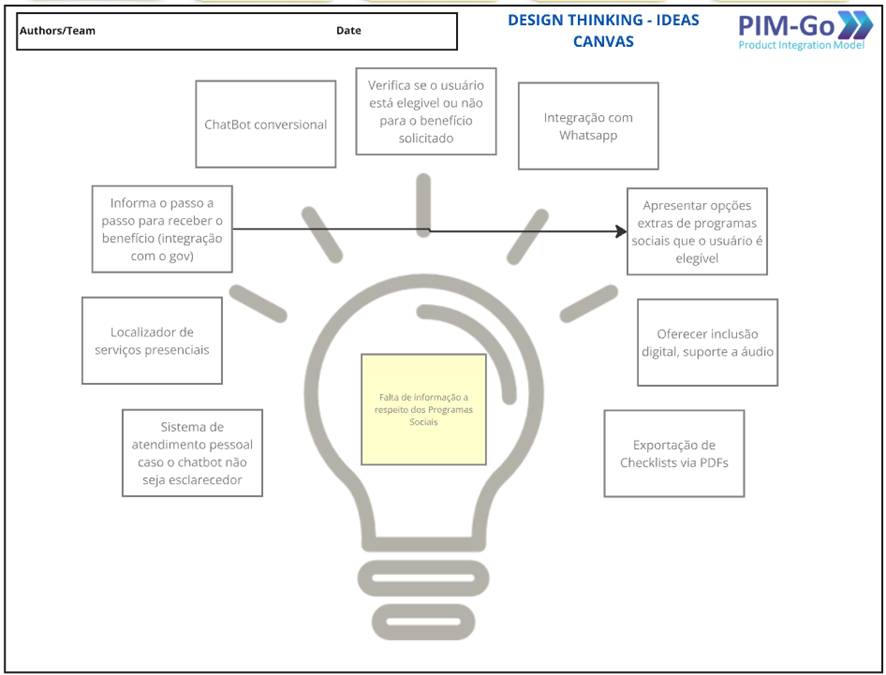
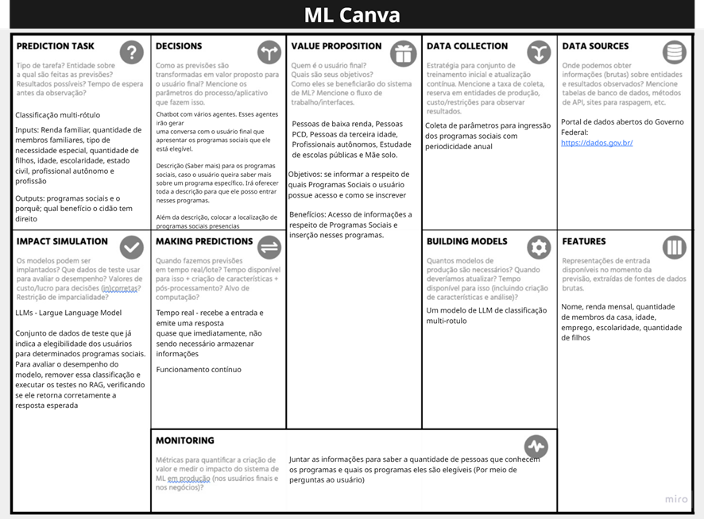

## Histórico de versões

| Versão | Alteração       | Responsável         | Data Alteração |
|--------|-----------------|---------------------|----------------|
| 1.0    | visão geral do produto | Mariana Pereira | 19/10/2025  |

## Visão geral

# Descrição do produto

O projeto propõe o desenvolvimento de uma solução inteligente voltada para a democratização do acesso a informações sobre benefícios sociais. Observa-se que, frequentemente, essas informações não são divulgadas de maneira clara e acessível, apresentando linguagem técnica e processos excessivamente burocráticos. Como consequência, muitos cidadãos que possuem direito aos benefícios acabam não os solicitando por falta de compreensão ou por desmotivação diante da complexidade do processo.

Diante desse cenário, o objetivo do projeto é facilitar o acesso a essas informações por meio de um chatbot capaz de interagir com o usuário, coletar os dados necessários e identificar, de forma automatizada, se o indivíduo atende aos requisitos para determinado benefício. Além disso, a solução busca orientar o usuário em relação ao processo de solicitação, fornecendo instruções detalhadas, como a lista de documentos necessários, etapas para obtenção, orientações sobre inscrição e, quando aplicável, o endereço do órgão responsável.

Dessa forma, o sistema visa não apenas simplificar o entendimento sobre os benefícios disponíveis, mas também promover inclusão social e autonomia, permitindo que mais pessoas possam exercer seus direitos de maneira prática e acessível.

---

# Fishbone

O diagrama de Ishikawa, também conhecido como Diagrama de Espinha de Peixe (Fishbone), é uma ferramenta utilizada para identificar e compreender as causas raízes de um problema específico. Seu principal objetivo é auxiliar na análise estruturada de fatores que contribuem para a ocorrência de determinado problema, permitindo uma visão mais ampla e detalhada das possíveis origens.

No contexto deste projeto, o método foi aplicado com o propósito de aprofundar o entendimento sobre a falta de acesso a informações referentes aos programas sociais. Por meio dessa análise, foi possível identificar que o problema afeta diretamente grupos em situação de vulnerabilidade, como pessoas de baixa renda, pessoas com deficiência (PCD), idosos, mães solos, estudantes de escolas públicas e profissionais autônomos.

As causas levantadas incluem a burocracia excessiva nos processos, a linguagem técnica utilizada na comunicação governamental, a baixa divulgação das informações e a falta de acessibilidade aos canais oficiais. Como consequência, muitos cidadãos acabam não tendo conhecimento sobre os benefícios disponíveis ou não sabem como acessá-los, o que resulta em dificuldade de obtenção de direitos básicos, evasão escolar, prejuízos econômicos e aumento da vulnerabilidade social.

A aplicação do Fishbone, portanto, permitiu compreender de forma mais estruturada os fatores que reforçam a desinformação sobre benefícios sociais, servindo como base para a formulação da solução proposta pelo projeto, um chatbot acessível e informativo, voltado à promoção da inclusão social e do acesso equitativo a direitos.

---

# Ideação – Design Thinking (Ideas Canvas)

O Ideas Canvas é uma ferramenta de brainstorming visual utilizada para estruturar, organizar e priorizar ideias, funcionalidades e desafios relacionados a um projeto. Essa metodologia facilita o alinhamento estratégico da equipe, permitindo identificar de forma clara quais soluções têm maior potencial de impacto sobre o problema central.

No contexto deste projeto, o Ideas Canvas foi aplicado com o objetivo de propor soluções inovadoras para o problema identificado anteriormente, a falta de informação sobre os programas sociais. A partir dessa análise, foram geradas e categorizadas diversas ideias voltadas à criação de uma ferramenta tecnológica acessível e inclusiva.

Entre as propostas levantadas, destaca-se o chatbot conversacional, que representa o núcleo da solução. Esse sistema visa interagir com o usuário de maneira intuitiva, coletar informações e verificar a elegibilidade para benefícios sociais. Além disso, outras funcionalidades foram pensadas para complementar e aprimorar a experiência do usuário, como:

- Integração com o WhatsApp, facilitando o acesso do usuário por meio de um canal amplamente utilizado;  
- Apresentação de programas sociais adicionais, para os quais o usuário também possa ser elegível;  
- Localizador de serviços presenciais, auxiliando na busca por órgãos e centros de atendimento próximos;  
- Sistema de atendimento humano, disponível caso o chatbot não seja suficiente para esclarecer dúvidas;  
- Exportação de checklists em PDF, permitindo que o usuário salve ou imprima as informações relevantes;  
- Suporte à inclusão digital, com recursos de áudio e acessibilidade para pessoas com deficiência visual ou baixa familiaridade com tecnologia.

Com isso, o Ideas Canvas contribuiu para a visualização integrada da solução, auxiliando na priorização de funcionalidades essenciais e no alinhamento da proposta à necessidade social identificada. O resultado foi uma concepção de sistema centrado no usuário, com foco em inclusão, acessibilidade e eficiência na disseminação de informações públicas.

---

# ML Canvas

O Machine Learning Canvas (ML Canvas) é uma ferramenta de planejamento estratégico utilizada para estruturar projetos que envolvem aprendizado de máquina, garantindo uma visão clara e integrada dos seus principais componentes. Ele permite definir de forma visual e organizada os objetivos do modelo, as fontes de dados, as tarefas de predição, as decisões associadas, além de aspectos de monitoramento e impacto. Dessa forma, o ML Canvas auxilia na alinhamento entre o propósito do projeto e as soluções técnicas de IA, promovendo um desenvolvimento mais orientado e eficiente.

No contexto deste projeto, o ML Canvas foi aplicado com o objetivo de estruturar o desenvolvimento de um modelo de classificação multi-rótulo, responsável por identificar quais programas sociais um cidadão tem direito a acessar. O modelo utiliza como entradas variáveis como renda familiar, número de dependentes, idade, escolaridade, profissão e estado civil, gerando como saída os programas sociais elegíveis e suas respectivas justificativas.

Durante o processo de elaboração do Canvas, foram definidos os principais componentes do sistema:

- Tarefa de previsão: classificação multi-rótulo de elegibilidade a benefícios sociais;  
- Fontes de dados: Portal de Dados Abertos do Governo Federal;  
- Coleta de dados: parâmetros de elegibilidade dos programas, atualizados periodicamente;  
- Modelo: LLM (Large Language Model) treinado para análise e inferência em tempo real;  
- Tomada de decisão: integração com o chatbot, que apresenta os resultados de forma acessível ao usuário;  
- Monitoramento: análise contínua da quantidade de pessoas que identificaram e acessaram benefícios após o uso da ferramenta.

Como resultado, a aplicação do ML Canvas proporcionou clareza na definição das etapas do modelo de IA, garantindo que cada componente estivesse alinhado ao objetivo social do projeto. A ferramenta também auxiliou na identificação de requisitos técnicos e fontes de dados confiáveis, além de orientar o desenho do fluxo de predição integrado ao chatbot. Assim, o ML Canvas foi fundamental para transformar uma proposta conceitual em uma solução prática, estruturada e socialmente relevante, que busca democratizar o acesso a informações sobre programas sociais.

